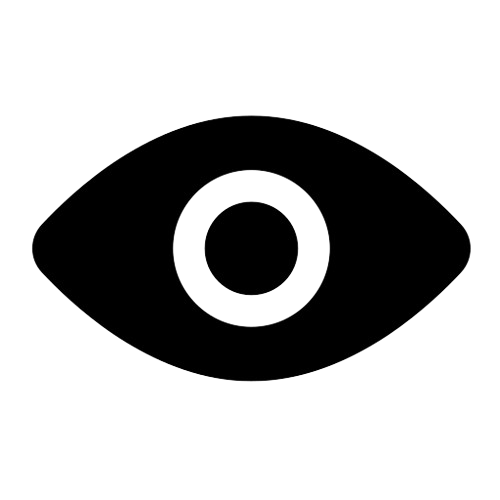

# SMART GNSS SYSTEM
## *A mobile application for geofencing, navigation and location-based services.*

# OVERVIEW 

The smart GNSS system is an android based mobile application that provides efficient geofencing, location tracking and map navigation. This platform aims to solve real-world issues related to geofencing, location accuracy and navigation efficiency.

# OBJECTIVES 

1. Provide robust geofencing.
2. Provide accurate real-time location data.
3. Provide real-time location sharing(with consent).
4. Deliver map(OSM) navigation with access to various map tiles.
5. Offer capture coordinate feature.

# PROBLEM STATEMENTS 
